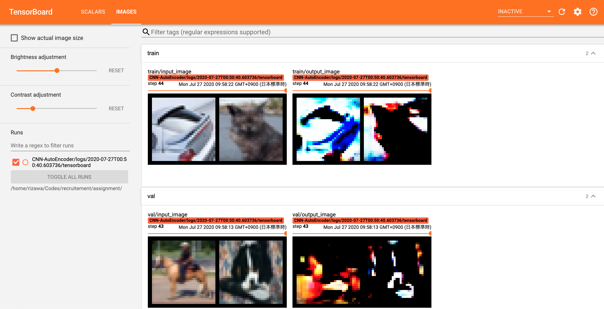

# CNN-AutoEncoder in pytorch
This is a pytorch implementation of the Muti-task Learning using CNN + AutoEncoder.  
Cifar10 is available for the datas et by default.  
You can also use your own dataset.

## Requirements
```bash
$ pip install -r requirements.txt
```

## Usage
### Configs
Create a configuration file based on configs/default.yml.
```bash
### dataset
##### if custom dataset
# dataset: 'custom'
# data_root: {path to dataset}
##### cifar10
dataset: cifar10
data_root: ./data/

n_classes: 10
classes: ['plane', 'car', 'bird', 'cat', 'deer', 'dog', 'frog', 'horse', 'ship', 'truck']
img_size: 32
n_channels: 3
color_mean: [0.4914, 0.4822, 0.4465]
color_std: [0.2023, 0.1994, 0.2010]

### train parameters
lr: 0.0001
decay: 1e-4
classification_loss_weight: 0.5
autoencoder_loss_weight: 0.5
n_gpus: 1
batch_size: 64
n_epochs: 50

# save_ckpt_interval should not be 0.
save_ckpt_interval: 50

# output dir (logs, results)
log_dir: ./logs/

# checkpoint path or None
resume:
# e.g) resume: ./logs/2020-07-26T00:19:34.918002/ckpt/best_acc_ckpt.pth
```

### Prepare Dataset
If you want to use your own dataset, you need to prepare a directory with the following structure:
```bash
datasets/
├── images
│   ├── hoge.png
│   ├── fuga.png
│   ├── foo.png
│   └── bar.png
├── train.csv
└── test.csv
```

The content of the csv file should have the following structure.
```bash
filename,     label
airplane1.png,0
car1.png,1
cat1.png,3
deer1.png,4
```

An example of a custom dataset can be found in the dataset folder.

### Train
```bash
$ python main.py --config ./configs/default.yml
```

### Inference
```bash
$ python main.py --config ./configs/default.yml --inference
```

### Tensorboard
```bash
tensorboard --logdir={log_dir} --port={your port}
```


## Output
You will see the following output in the log directory specified in the Config file.
```bash
# Train
logs/
└── 2020-07-26T14:21:39.251571
    ├── checkpoint
    │   ├── best_acc_ckpt.pth
    │   ├── epoch0000_ckpt.pth
    │   └── epoch0001_ckpt.pth
    ├── metrics
    │   ├── train_metrics.csv
    │   └── test_metrics.csv 
    ├── tensorboard
    │   └── events.out.tfevents.1595773266.c47f841682de
    └── logfile.log

# Inference
inference_logs/
└── 2020-07-26T14:21:06.197407
    ├── metrics
    │   ├── test_cmx.png
    │   └── test_metrics.csv 
    ├── tensorboard
    │   └── events.out.tfevents.1595773266.c47f841682de
    └── logfile.log
```

The contents of train_metrics.csv and test_metrics.csv look like as follows:
```bash
epoch,train loss,train accuracy,train precision,train recall,train micro f1score
0,0.024899629971981047,42.832,0.4283200204372406,0.4215449392795563,0.42248743772506714
1,0.020001413972377778,54.61,0.5461000204086304,0.5404651761054993,0.5422631502151489
```
You will get loss, accuracy, precision, recall, micro f1score during training and as a result of inference.

The content of test_cmx.png is a confusion matrix.
